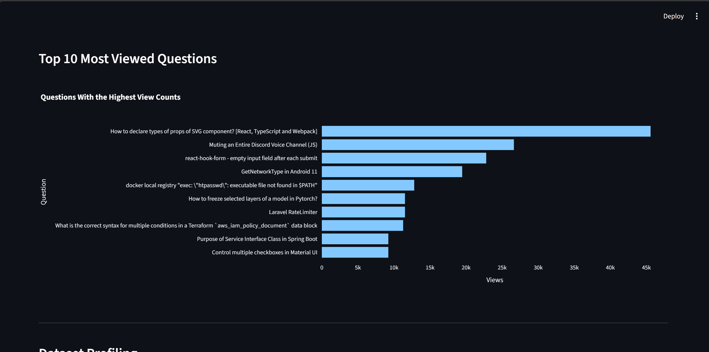
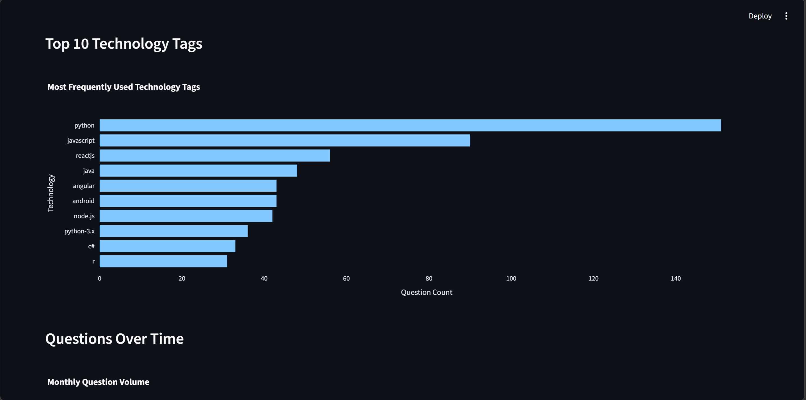

 # AI Business Intelligence Copilot

An AI-powered Business Intelligence application built with **Python**, **Streamlit**, **Pandas**, **Plotly**, and **Google Gemini AI**.

The application enables users to upload a Stack Overflow dataset, automatically analyse key performance indicators, visualise trends, profile data quality, generate AI-powered executive reports, and ask natural-language questions about the data.

---

# Project Overview

This project demonstrates how Business Intelligence, Data Analytics and Generative AI can be combined into a single interactive application.

After uploading a Stack Overflow dataset, the application automatically:

- Calculates business KPIs
- Analyses technology trends
- Tracks question activity over time
- Measures accepted answer rates
- Identifies the most viewed questions
- Performs data profiling
- Detects duplicate and missing values
- Generates AI-powered executive reports
- Answers business questions using Gemini AI

---

# Key Features

- Upload CSV datasets
- KPI dashboard
- Interactive Plotly visualisations
- Technology tag analysis
- Time-series analysis
- Accepted answer analysis
- Most viewed question analysis
- Dataset profiling
- Data quality assessment
- AI-generated executive reports
- Natural language Q&A using Gemini
- Downloadable AI report

---

# Technologies Used

- Python
- Streamlit
- Pandas
- Plotly
- Google Gemini API
- python-dotenv
- GitHub
- VS Code

---

# Dataset

This application uses the **Stack Overflow Public Dataset**.

Expected columns:

```text
title
tags
creation_date
answer_count
score
view_count
accepted_answer_id
```

---

# Application Preview

## Dashboard Overview

### Technology Trends & Question Volume



---

### Accepted Answers & Most Viewed Questions



---

# AI Executive Report

The application automatically generates a management-style report using Google Gemini AI.

The report includes:

- Executive Summary
- Key Trends
- Engagement Analysis
- Data Quality Assessment
- Business Recommendations

### Example Insight

> The uploaded dataset contains 1,000 Stack Overflow questions generating more than 1.1 million total views. Python, JavaScript, ReactJS, Java and Android are the dominant technology tags. The accepted-answer rate is 52.8%, while no exact duplicate rows were detected.

---

# Ask AI About Your Dataset

Users can ask natural-language questions such as:

- Which engagement metric should be investigated first?
- Which technology appears most frequently?
- What are the main data quality issues?
- Summarise this dataset for senior management.
- Which questions generated the highest engagement?

The AI answers using only the calculated dataset context and is instructed not to generate unsupported conclusions.

---

# Project Workflow

```text
CSV Upload
      │
      ▼
Data Validation
      │
      ▼
Data Cleaning
      │
      ▼
KPI Calculation
      │
      ▼
Interactive Dashboards
      │
      ▼
Data Profiling
      │
      ▼
Data Quality Assessment
      │
      ▼
AI Executive Report
      │
      ▼
Ask AI About the Dataset
```

---

# Key Metrics

The application automatically calculates:

- Total Questions
- Total Views
- Average Views per Question
- Average Score
- Average Answers per Question
- Accepted Answer Rate
- Duplicate Rows
- Missing Values

---

# How to Run the Project

## 1. Clone the repository

```bash
git clone https://github.com/YOUR_USERNAME/AI-BI-Copilot.git
cd AI-BI-Copilot
```

## 2. Create a virtual environment

```bash
python -m venv venv
```

## 3. Activate the virtual environment

### Windows PowerShell

```powershell
.\venv\Scripts\Activate.ps1
```

### Windows Command Prompt

```cmd
venv\Scripts\activate.bat
```

## 4. Install dependencies

```bash
pip install -r requirements.txt
```

## 5. Create a `.env` file

```text
GEMINI_API_KEY=your_api_key_here
```

## 6. Run the application

```bash
streamlit run app/main.py
```

---

# Skills Demonstrated

This project demonstrates practical experience with:

- Python Programming
- Data Analysis using Pandas
- Business Intelligence
- KPI Development
- Interactive Dashboard Design
- Data Profiling
- Data Quality Assessment
- Data Visualisation
- Streamlit Application Development
- API Integration
- Prompt Engineering
- Generative AI
- Business Reporting
- Data Storytelling
- Git & GitHub

---

# Future Improvements

Possible future enhancements include:

- PDF report export
- User-selectable dashboard filters
- Multi-dataset support
- Session-based AI chat history
- Additional visualisations
- Cloud deployment improvements

---

# Author

**Anshuli Chauhan**

MSc Business Analytics | Business Intelligence & Data Analytics
